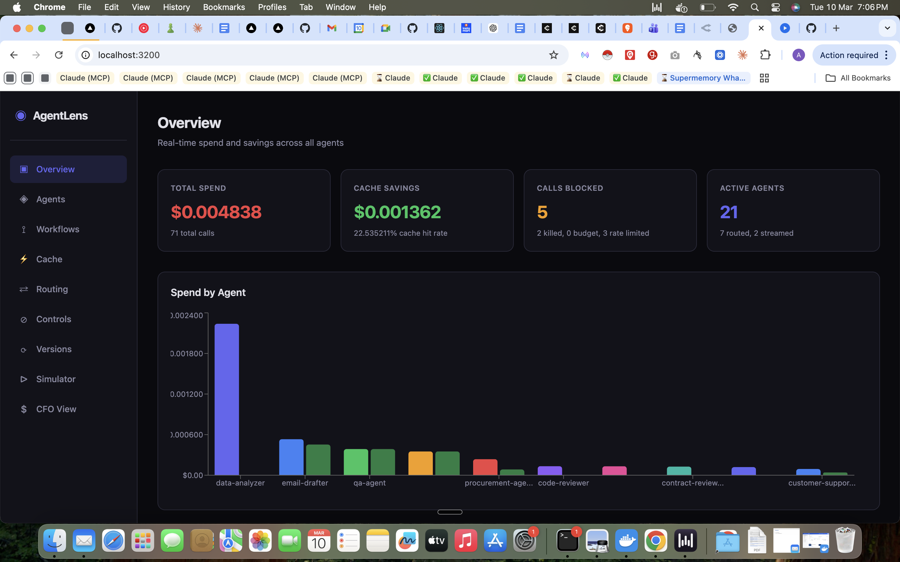
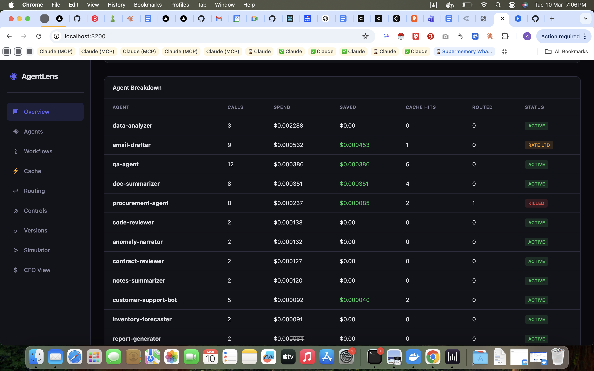
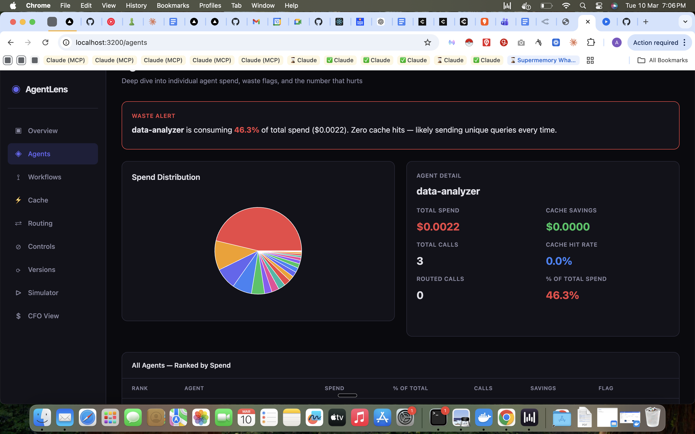
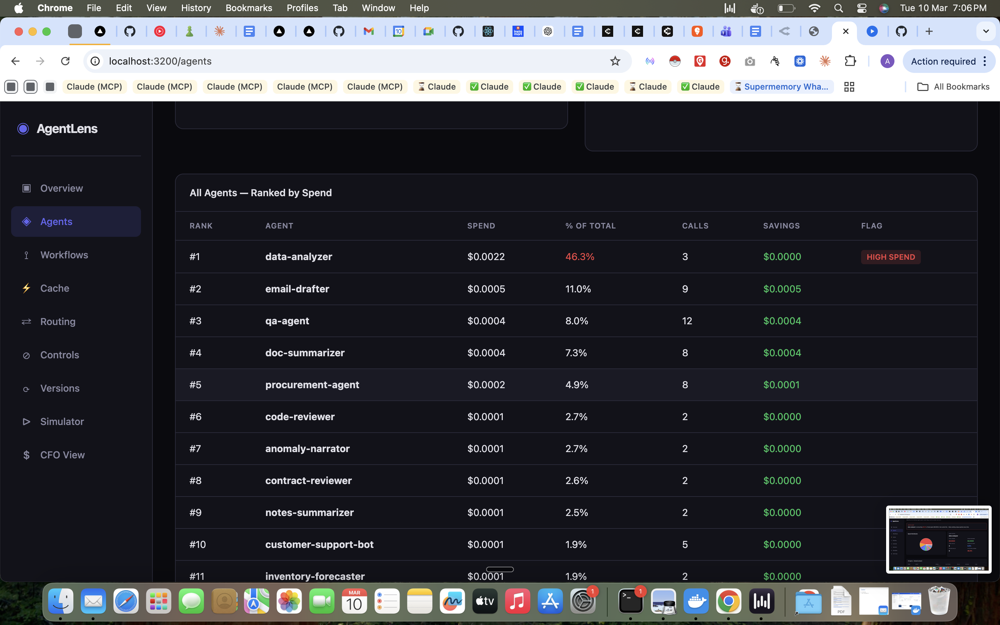
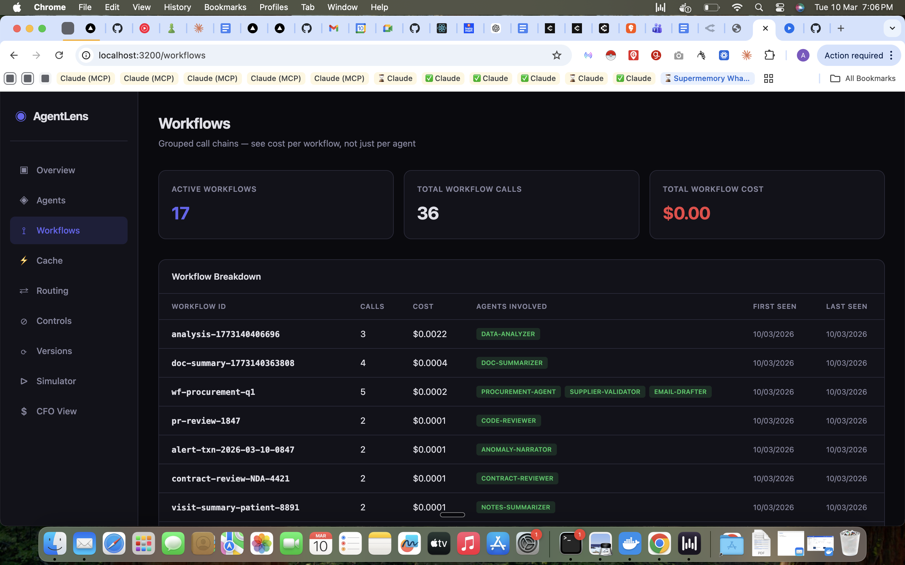
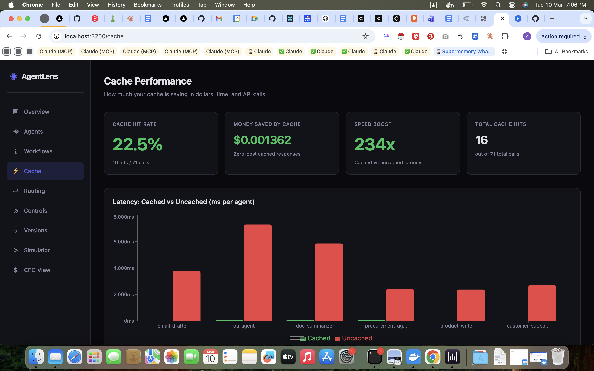
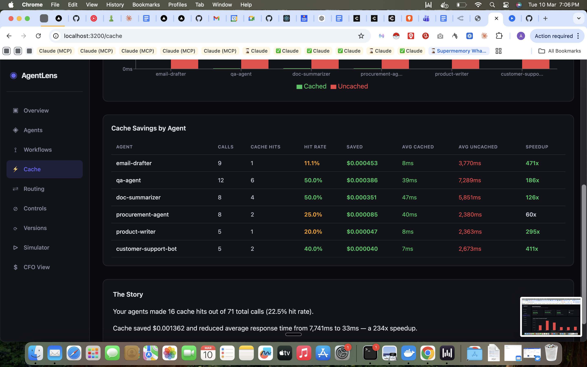
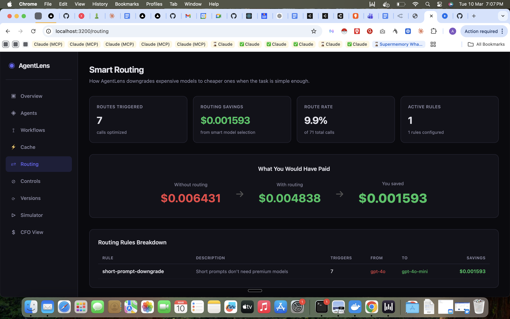
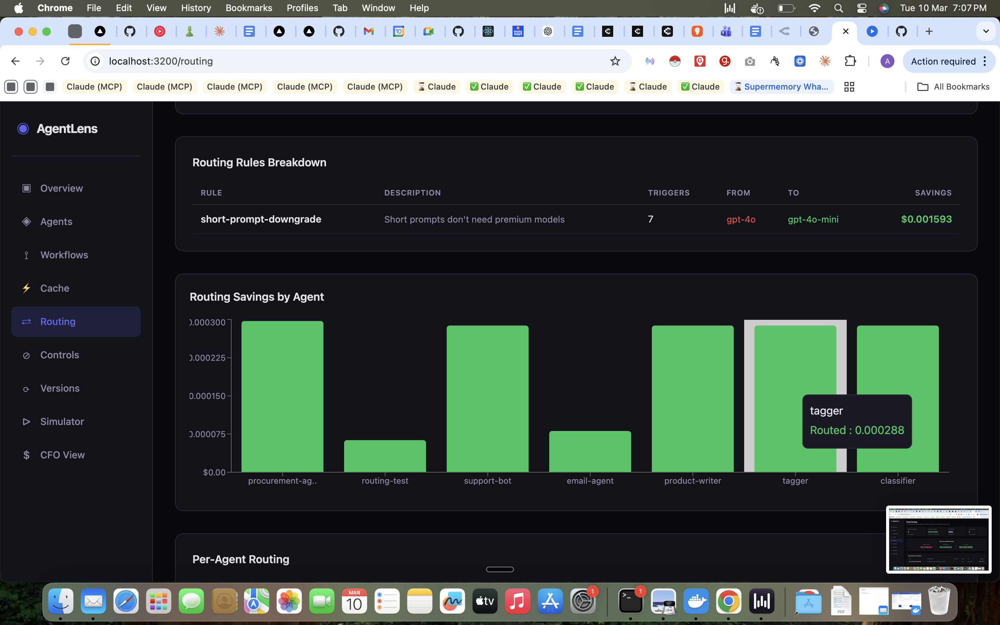
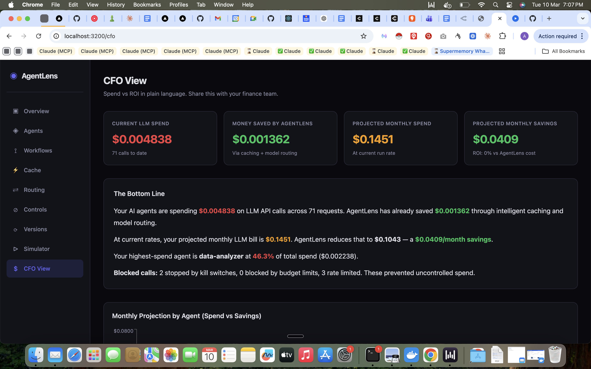

# AgentLens

**See every dollar your AI agents spend. Control it. Cut it.**

LLM cost optimization proxy that sits between your agents and OpenAI. Drop-in replacement -- one line change, zero code refactor.

[](LAUNCH_STACK_URL_PLACEHOLDER)

---

## What It Does

- Intercepts every LLM API call your agents make
- Caches identical queries (234x faster, $0 repeat cost)
- Auto-routes expensive models to cheaper ones (gpt-4o to gpt-4o-mini for simple tasks)
- Kill switches, budget limits, rate limits per agent
- Real-time dashboard with 9 screens
- Deploys into YOUR AWS account -- your data never leaves your infrastructure

## Architecture

```
Your Agents ──> AgentLens Proxy (Lambda) ──> OpenAI / Any LLM
                     |
              ┌──────┼──────┐
              v      v      v
           DynamoDB  Cache   Controls
              |
              v
         Dashboard (CloudFront)
```

The proxy is a single Lambda function behind API Gateway. It logs every request to DynamoDB, checks cache before forwarding, applies routing rules, and enforces controls. The dashboard is a static React app served from CloudFront that reads directly from DynamoDB.

## Integration

```python
# Before -- direct to OpenAI
client = OpenAI()

# After -- through AgentLens (one line change)
client = OpenAI(base_url="https://your-agentlens-proxy.amazonaws.com/prod")
```

Tag your calls with agent and workflow metadata using headers:

```python
response = client.chat.completions.create(
    model="gpt-4o",
    messages=[...],
    extra_headers={
        "x-agent-id": "my-agent",        # required
        "x-workflow-id": "batch-123",     # optional
    }
)
```

That is it. No SDK, no wrapper library, no code refactor. Any OpenAI-compatible client works.

## Dashboard

### Overview — Total spend, savings, blocked calls, active agents


### Agent Breakdown — Per-agent cost, cache hits, status (active/killed/rate limited)


### Waste Detection — Flags agents consuming disproportionate spend with zero cache hits


### Agent Ranking — All agents ranked by spend with HIGH SPEND flags


### Workflows — Grouped call chains showing cost per workflow and agents involved


### Cache Performance — Hit rate, money saved, speed boost (234x), per-agent breakdown


### Cache Savings by Agent — Hit rates, cached vs uncached latency, per-agent speedup


### Smart Routing — Model downgrades, before/after cost comparison, per-agent savings


### Routing Savings by Agent — Which agents benefit most from smart model selection


### CFO View — Executive summary in plain language. Monthly burn, projected savings, ROI.


## Deploy to AWS

1. Click the **Deploy to AWS** button above (or run `./infra/deploy.sh --bucket=your-s3-bucket`)
2. Enter your OpenAI API key in the CloudFormation stack parameters
3. Click **Create Stack** -- deploys in ~15 minutes
4. Find your proxy URL and dashboard URL in the stack **Outputs** tab

The CloudFormation template (`infra/template.yaml`) provisions:
- API Gateway + Lambda (proxy)
- DynamoDB tables (logs, cache, controls, budgets, rate limits, versions)
- S3 + CloudFront (dashboard)
- IAM roles with least-privilege policies

## What You Get

- **Real-time data**: Every call logged with cost, latency, tokens, model, agent, workflow
- **Cache savings**: Identical queries served from cache at 234x speed, $0 cost
- **Smart routing**: Short prompts auto-downgraded to cheaper models
- **Safety controls**: Kill switch any agent instantly, set budget caps, rate limits
- **Per-agent cache**: Toggle caching on/off per agent, custom TTL (e.g., procurement=24h, inventory=1h)
- **Prompt versioning**: Track prompt changes per agent, compare performance across versions
- **CFO-ready reports**: Monthly burn, projected savings, cost-per-agent breakdown

## Headers Reference

| Header | Required | Description |
|--------|----------|-------------|
| `x-agent-id` | Yes | Identifies the calling agent |
| `x-workflow-id` | No | Groups related calls into a workflow |
| `x-prompt-version` | No | Tracks prompt versions for A/B testing |
| `x-cache` | No | Set to `skip` to bypass cache for this request |

## API Endpoints

| Endpoint | Method | Description |
|----------|--------|-------------|
| `/v1/chat/completions` | POST | OpenAI-compatible chat endpoint |
| `/health` | GET | Health check |
| `/api/stats` | GET | Dashboard statistics |
| `/api/controls` | POST | Kill switch toggle |
| `/api/budgets` | POST | Budget limits |
| `/api/rate-limits` | GET/POST | Rate limit configuration |
| `/api/cache-controls` | POST | Per-agent cache settings |
| `/api/versions/:agentId` | GET | Prompt version history |

## Local Development

```bash
# Prerequisites: Node.js 20+, Docker (for DynamoDB Local)

# 1. Start DynamoDB Local
docker run -p 8000:8000 amazon/dynamodb-local

# 2. Set up tables + seed demo data
npm run setup:local

# 3. Start proxy
cd proxy && node src/server.js

# 4. Start dashboard
cd dashboard && npm start

# 5. Run demo agents
./demo/run-demo.sh
```

The demo ships with a simulated ERP system (Opera PMS) running 5 agents -- procurement, inventory, forecasting, reporting, and compliance -- making real LLM calls through the proxy so you can see the dashboard populate with live data.

## Project Structure

```
agentlens/
  proxy/src/
    handler.js        # Request routing and middleware
    cache.js          # Semantic cache with DynamoDB backend
    cost.js           # Token counting and cost calculation
    router.js         # Model routing rules (gpt-4o -> gpt-4o-mini)
    rate-limiter.js   # Per-agent rate limiting
    dynamo.js         # DynamoDB client and table operations
    lambda.js         # Lambda entry point
    server.js         # Local development server
  dashboard/
    src/              # React dashboard (9 screens)
    public/
  infra/
    template.yaml     # CloudFormation template
    deploy.sh         # Deployment script
    setup-local.js    # Local DynamoDB table creation
    tables.json       # Table definitions
  demo/
    agents/           # Sample ERP agents
    run-demo.sh       # Run all demo agents
    seed.js           # Seed demo data
```

## Built with NPC Guide

This entire project was built in a single Claude Code session using [NPC Guide](https://github.com/Abhipaddy8/npc-guide-ai) — a mission system for AI coding agents.

One brief. 7 missions generated. 7 missions completed autonomously. The agent only asked for file write permissions — zero architecture questions, zero "should I start?" prompts.

**What NPC Guide provided:**
- Mission map: 7 sequential missions from Proxy MVP to Ship
- Architecture doc: stack decisions, DynamoDB schema, proxy flow
- Decision log: 6 founding decisions (Node.js, DynamoDB, React, CloudFormation, monorepo, OpenAI-only v1)
- Session context injection so the agent never lost track of where it was

## License

MIT

## Built by

Abhishek Padmanabhan -- abhipaddy8@gmail.com
